# GALISpace
Ecommerce store written in PHP and using MySQL Database.

### Caution:
This site has multiple vulnerabilities such as cookie-editor and some sql-injection, path traversal. Care must be taken if it is used for a deploy that is not a demo. (It is a school project so it was not necessary to take care of these aspects)

## Screenshots
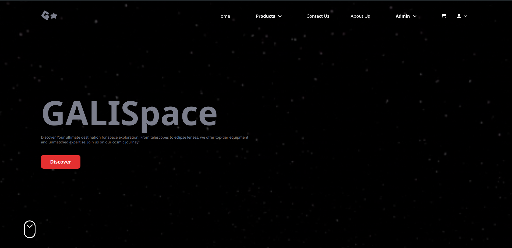

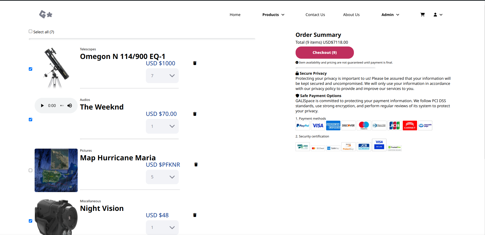
### Light and Dark mode
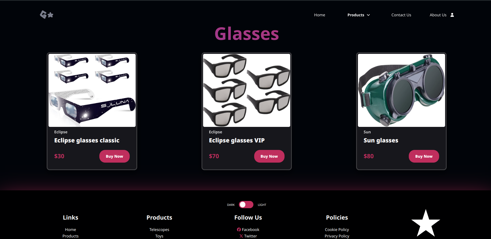
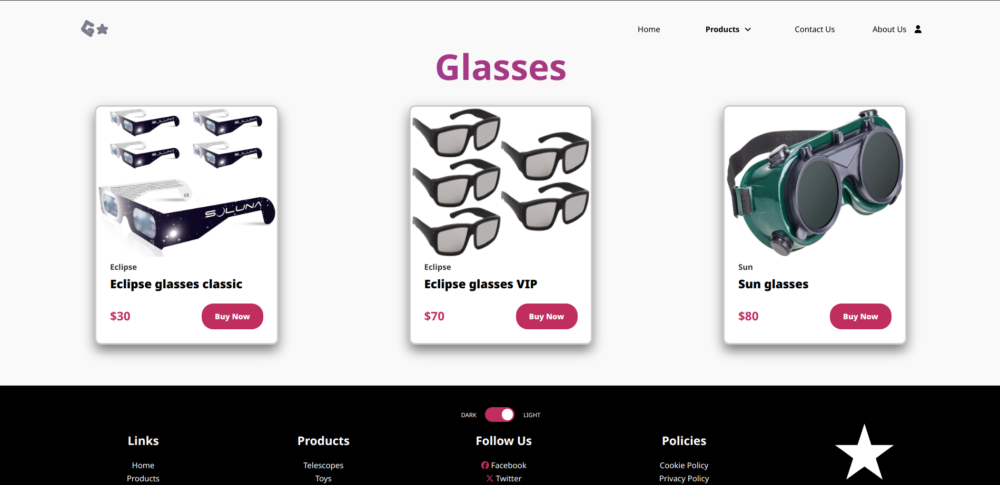
### Admin panels
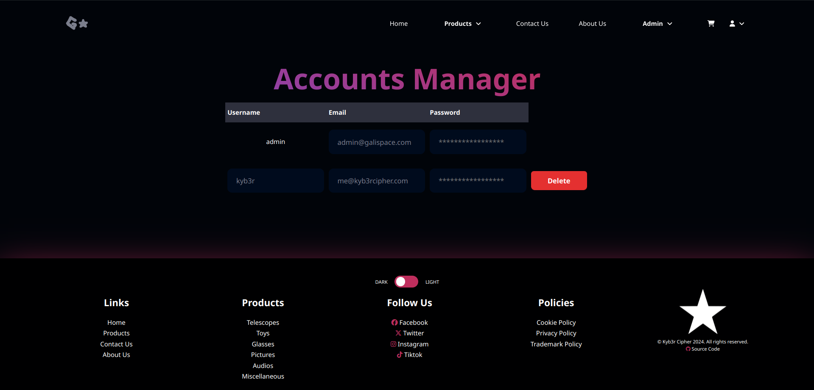
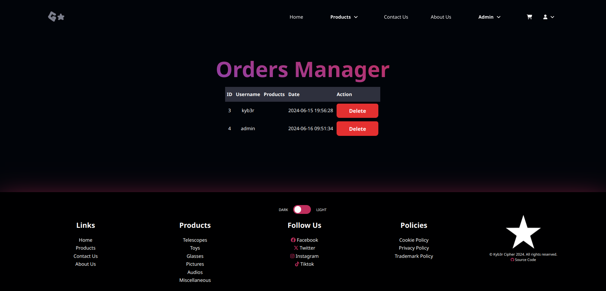
### Responsive
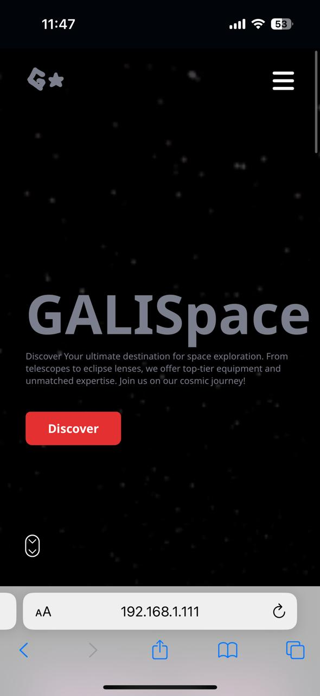
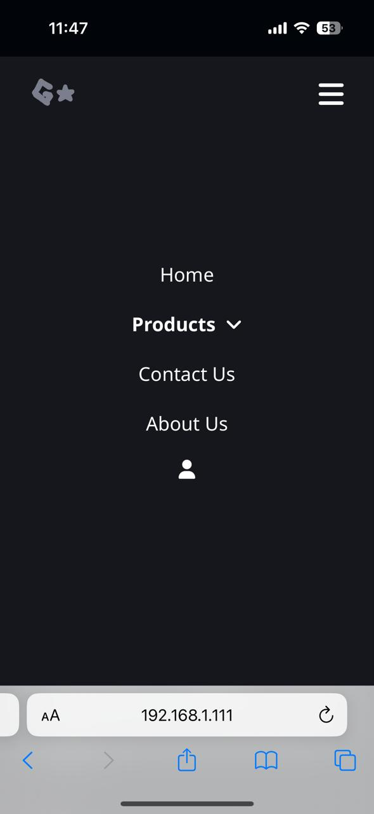
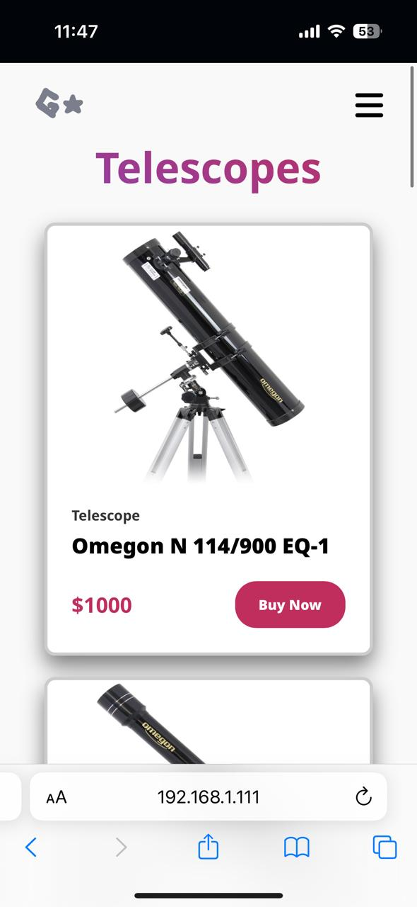
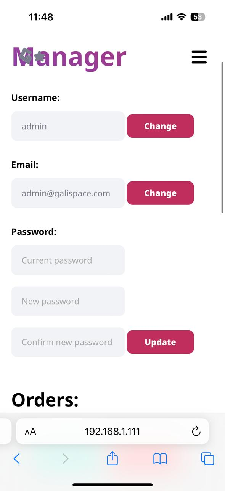
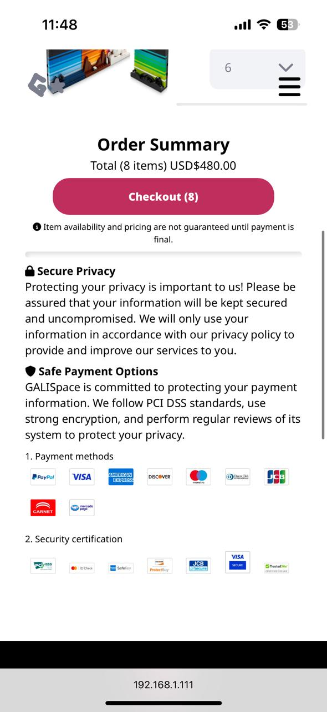

## Credits
- [DяA (Daniel Ruiz de Alegría)](https://drasite.com/).
- Flat-Remix.
- [Skeuos CSS Library](https://drasite.com/skeuos-css/).
- [Font Awesome Icons](https://fontawesome.com/).
- Google Fonts.
- Miscellaneous images.
- Partially based on Kali Linux [home page](https://www.kali.org/).
- 404 Website by [@vikas-kukreti](https://github.com/vikas-kukreti/404-error-page).